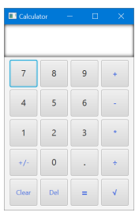

# JavaFX Calculator

A calculator built with JavaFX 17 and Maven (University of Kent, CO871 Assignment 2). Implements four binary operations and two unary operations with a clean FXML-driven UI.



## Operations

| Type | Operations |
|------|-----------|
| Binary | Addition, subtraction, multiplication, division |
| Unary | Square root, negation |

## Requirements

- Java 17
- Maven 3.6 or later (or use the included Maven Wrapper)

## Build and run

```bash
mvn clean javafx:run
```

Using the Maven Wrapper:

```bash
./mvnw clean javafx:run    # macOS / Linux
mvnw.cmd clean javafx:run  # Windows
```

## Tests

JUnit Jupiter 5 tests exercise all operations and edge cases:

```bash
mvn test
```

## Tech stack

| Component | Version |
|-----------|---------|
| Java | 17 |
| JavaFX (controls + FXML) | 17.0.2 |
| JUnit Jupiter | 5.8.2 |
| Build tool | Maven |
